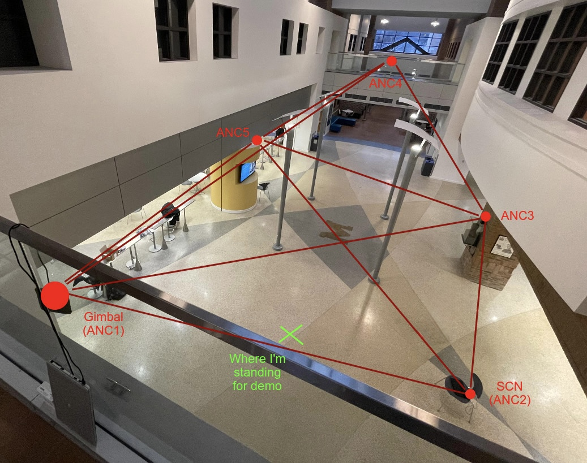
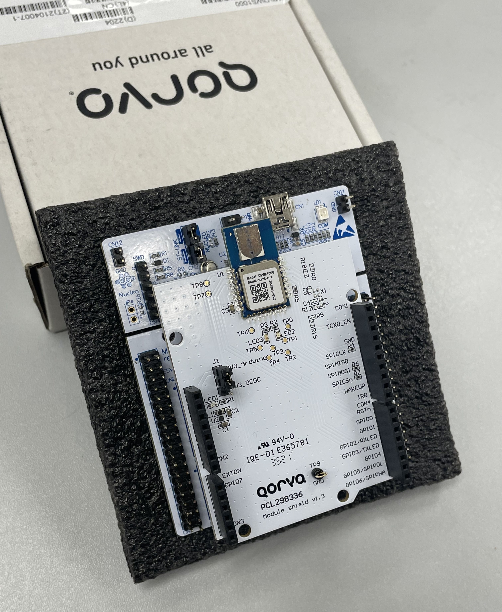

# Real-Time UWB Indoor Localization & Tracking

A real-time embedded indoor localization system built around **Ultra-Wideband (UWB) ranging**, custom communication protocols, embedded linear algebra, and real-time geometric reconstruction.

The resulting position data can be streamed to a visualization system and used to control external hardware such as a gimbal-mounted light source, allowing the system to both **visualize and physically track the target**.

---

# Key Features

* **6-node UWB localization network (5 anchors + 1 moving tag)**
* DWM1000 UWB transceivers
* STM32F401RE embedded implementation
* Custom four-hop ranging protocol
* Master/slave state machines
* Automatic communication recovery
* MAC-address filtering
* High-speed SPI communication
* Runtime anchor geometry reconstruction
* Custom made embedded linear algebra functions
* Median-based outlier rejection, batch averaging, and Kalman filtering
* Real-time PC visualization with VisPy
* Optional physical 2-axis gimbal tracking
* Purely embedded position estimation @ 100 Hz

---

## Demo

The demonstrations below show the real-time visual tracking system in operation. Note: The visualization on the right is rotating clockwise about the Z-axis; ANC1 is the origin.

### Side-by-side demonstration

<p align="center">
  <a href="https://youtu.be/r9-aWdndoho">
    
  </a>
</p>
Note: If video doesn't display, reference `Media/demo.mp4`

### Reference Node Locations in Demo
<div align="center">
  
</div>

---

# System Architecture

At a high level, the system consists of:

```text
                  ┌───────────────────┐
                  │   Moving Tag      │
                  │   DWM1000 +       │
                  │   STM32F401RE     │
                  └─────────┬─────────┘
                            │
                     UWB ranging
                            │
             ┌──────────────┼──── ... ─────┐
             │              │              │
             ▼              ▼              ▼
        ┌─────────┐    ┌─────────┐    ┌─────────┐
        │ Anchor  │    │ Anchor  │    │ Anchor  │
        │    1    │    │    2    │    │    5    │
        └─────────┘    └─────────┘    └─────────┘
             │              │              │
             └──────────────┼──── ... ─────┘
                            │
                            ▼
                  ┌───────────────────┐
                  │ Geometry Recovery │
                  │ & Localization    │
                  └─────────┬─────────┘
                            │
                            ▼
                  ┌───────────────────┐
                  │ Position Filtering│
                  │ / Kalman Filter   │
                  └─────────┬─────────┘
                            │
                            ▼
                  ┌───────────────────┐
                  │    Tag sends      │
                  │   Position info.  │
                  │ to SCN (ANC2) and │
                  │   Gimbal (ANC1)   │
                  └─────────┬─────────┘
                            │
                   ┌────────┴────────┐
                   ▼                 ▼
           ┌──────────────┐   ┌──────────────┐
           │ PC / VisPy   │   │   Gimbal /   │
           │ Visualization│   │ Laser Target │
           └──────────────┘   └──────────────┘
```

---

### UWB Nodes

The system uses six DWM1000 UWB devices:

* **5 fixed anchor nodes**
* **1 moving tag node**

Each DWM1000 is hosted by an **STM32F401RE** microcontroller.

<div align="center">
  
</div>

Every UWB node has a unique address, allowing the custom communication protocol to identify and selectively communicate with individual nodes using MAC filtering.

### External Systems

The localization output can be consumed by:

* A PC running a **VisPy** visualization (connected to AN2 over USB)
* A 2-axis servo gimbal system

The gimbal provides a physical demonstration of the localization system by converting the calculated target position into angular commands for its servos. By setting the anchor geometry origin at the gimbal, this was simple as the tag's estimated position is consequently the vector the gimbal must align itself on.

---

# UWB Communication

One of the largest portions of the project was developing the UWB communication layer directly around the DWM1000.

The DWM1000 datasheet and register configuration were used to determine the required configuration for:

1. Initial device operation
2. Packet transmission
3. Timestamp acquisition
4. Distance calculation
5. MAC filtering
6. High-speed ranging transactions

The suggested communication configuration was also optimized further.

### Communication optimizations

Several low-level changes were made to reduce transaction latency:

* Increased PRF from **16 to 64**
* Reduced the preamble from **256 to 64**
* Replaced the higher-level `HAL_SPI` path with the lower-level `LL_SPI` implementation
* Precomputed and optimized portions of the numerical processing
* Removed unnecessary communication protocol wait states

These changes reduced a single four-hop distance transaction from approximately `~1.8 ms` to ~`0.6 ms`

The optimized transaction became heavily dominated by the actual radio communication. The associated mathematical processing and interrupt/setup work were measured in roughly the **10 µs** and **40 µs** ranges respectively.

---

# Custom Ranging Protocol

Once basic ranging was functional, the next challenge was coordinating multiple nodes reliably.

The system ultimately uses a **four-hop ranging protocol** implemented as multiple linked finite-state machines (FSM).

Both master and slave nodes have their own state-machine logic, allowing them to:

* Initiate ranging
* Respond to ranging requests
* Validate received messages
* Detect missing messages
* Detect corrupted transactions
* Recover from unexpected node behavior
* Prevent the network from becoming permanently stuck

### Why four hops?

The protocol was developed through multiple iterations.

An initial two-hop protocol produced errors on the order of **10 meters**. Additional information was incorporated into the second-hop message, reducing the observed noise to approximately **30–60 cm**.

The final four-hop implementation took advantage of the minimum-error formulation described in the DWM1000 documentation, reducing protocol-related ranging error to approximately **0.8 cm** under the tested conditions.

At that point, antenna orientation effects could produce errors of up to roughly **15 cm**, becoming a larger practical limitation than the communication protocol itself.

A three-hop implementation could potentially reduce transaction time further, but was outside the scope of the project.

---

# Fault Recovery

Reliability was treated as a core part of the communication protocol rather than assuming every transaction would succeed.

The ranging FSM includes recovery mechanisms for cases such as:

* Lost packets
* Corrupted packets
* Unexpected duplicate messages
* Nodes going offline
* Invalid state transitions
* Failed master handoffs

A custom watchdog mechanism and message/error-register analysis allow the network to recover without becoming permanently blocked. This is present inside each of the FSMs.

This is particularly important in a multi-node ranging network: a single missed packet should not require the entire system to be restarted.

---

# Network Geometry

Once reliable distance measurements are available, the system has enough information to determine the relative geometry of the UWB nodes.

With five anchors, the system constructs a fully-connected graph from the pairwise distance relationships between the nodes.

Conceptually, the measurements form an upper-triangular distance matrix:

```text
          Anchor
            1      2      3      4      5
         ┌───────────────────────────────
Anchor 1 │ 0     d12    d13    d14    d15
       2 │        0     d23    d24    d25
       3 │               0     d34    d35
       4 │                      0     d45
       5 │                             0
```

From these distances, a symmetric matrix is constructed and eigendecomposition is used to recover a coordinate representation of the anchor geometry.

This follows the mathematics described here:

https://math.stackexchange.com/questions/156161/finding-the-coordinates-of-points-from-distance-matrix

The recovered geometry is inherently ambiguous up to these transformations:

* Rotation
* Reflection
* Translation

The system removes these ambiguities by constraining the origin (translation) and subsequently calibrating the recovered geometry against 3 known reference coordinates to be globally accurate. This was necessary for the gimbal to have correct end-effector updates.

---

# Embedded Linear Algebra and Eigendecomposition

The geometry reconstruction requires eigenvalues and eigenvectors.

Rather than relying on a large external linear algebra library, a custom eigendecomposition implementation was developed in C, alongside inverse functions and other supportive operations.

The Eigendecomposition implementation uses **Power iteration + Gram-Schmidt orthogonalization**

References for this algorithm design are found here:

https://ergodic.ugr.es/cphys/lecciones/fortran/power_method.pdf
https://www.cs.unc.edu/techreports/96-043.pdf

The implementation was specifically made for the small matrices required by this application rather than for general-purpose numerical computing.

---

# Coordinate-Frame Calibration

Recovering the anchor geometry provides a valid relative coordinate system, but not necessarily the desired global orientation. To correct this, the system uses three known reference vectors. 

The tag is positioned along each reference direction, and its measured coordinates are recorded. The recorded vectors and known reference vectors are normalized and used to solve an **orthogonal Procrustes problem**. 

This produces the transformation used to rotate the reconstructed network into the correct global coordinate frame.

The math behind this approach is described in the comment of `DWM_comm.h: TAG_initTransformAnchors()`

---

# Tag Localization

Once the anchor positions are known, the moving tag can be localized using its measured distances to the anchors.

The localization implementation is based on the **SR-LS approach** described in:

> Amir Beck, Petre Stoica, and Jian Li
> *Exact and Approximate Solutions of Source Localization Problems* 

> (10.1109/TSP.2007.909342)

The algorithm was selected for its robustness to Gaussian measurement noise. It was picked over the simpler **R-LS** approach as it was prone to creating poor geometry reconstruction.

The implementation is not a direct translation of the reference algorithm. Several components were precomputed or algebraically simplified to make the algorithm practical on the microcontroller.

---

## Embedded Optimization

A significant portion of the localization algorithm was optimized specifically for the embedded environment.

Rather than performing all matrix operations from scratch for every localization update, quantities that remain constant were precomputed.

Reference the paper and the `TAG_METADATA` struct in `DWM_comm.h` for which matrix structures are precomputed. Matrices were also often reduced to vectors or single values due to inherent sparsity of the original matrices.

The optimization also considers the numerical range encountered during normal operation, allowing the search parameters to be initialized near the region where solutions typically occur.

---

# Lambda Search

The localization algorithm requires finding a bias parameter `λ`.

The implementation uses a bounded binary-search procedure.

The search terminates when:

* The objective function approaches zero
* Floating-point resolution prevents further meaningful refinement
* A maximum iteration count is reached

The implementation also dynamically expands the upper search bound when necessary. This was specifically tuned for the numerical behavior observed during testing rather than treating the theoretical infinite search range as practical on the embedded target.

---

# Measurement Filtering

Raw UWB measurements contain noise and occasional invalid samples.

The system therefore performs multiple layers of filtering.

## Per-node redundant sampling

For each anchor, multiple distance samples are collected.

For the three-sample configuration:

```text
sample 1 ─┐
sample 2 ─┼─> median → outlier rejection → average
sample 3 ─┘
```

The median of the three samples is first identified.

Each other sample is then compared against the median. Measurements outside a configurable tolerance are rejected.

The remaining values are averaged to produce the distance estimate used by the localization algorithm.

This provides a simple but robust way of rejecting isolated bad UWB measurements without requiring a computationally expensive filtering algorithm.

---

# Batch Averaging

Multiple complete localization sample sets can also be combined.

The implementation uses a **logarithmic merge structure** when combining sample sets.

Instead of simply accumulating a long sequence of floating-point additions, samples are merged in layers:

```text
Example:

Sample 1 ─┐
          ├─> Sum ─┐
Sample 2 ─┘        │
                   ├─> Sum -> Average
Sample 3 ─┐        │
          ├─> Sum ─┘
Sample 4 ─┘

```

This approach was chosen to reduce floating-point accumulation error and preserve numerical behavior across the merge operations.

---

# Kalman Filtering

After localization, the resulting position is passed through a crude Kalman filter.

The filter provides additional smoothing of the final position estimate and suppresses residual measurement noise by taking the positional and speed delta metric between 't' and 't-1' updates and applying an RBF tolerance filter to those values. Stronger value updates are gives to ideal velocity targets (i.e. position at 't' strongly matches predicted position from t-1).

The resulting output was observed to remain within approximately **5–10 cm of the real target location** during testing, including the effects of antenna orientation and other practical sources of error.

---

# Performance

The system was designed around the constraint that all of the localization mathematics should run directly on the embedded target.

No desktop computer is required to perform the core localization calculations; **all** computation was completed on the tag node run only with a battery.

### Measured performance

| Metric                                        |         Result |
| --------------------------------------------- | -------------: |
| UWB ranging transaction                       |        ~0.6 ms |
| Original ranging transaction                  |        ~1.8 ms |
| Localization math                             | ~10 µs or less |
| Position update rate                          |        ~100 Hz |
| Position update rate with additional sampling |         ~60 Hz |
| Samples / anchor @ 100 Hz                     |              3 |
| Samples / anchor @ 60 Hz                      |              6 |
| Protocol ranging error                        |        ~0.8 cm |
| Observed antenna-orientation error            |   up to ~15 cm |
| Final filtered position accuracy              |       ~5–10 cm |

The exact results depend on physical geometry (flat plane anchor geometry performs signficantly worse), antenna orientation, environmental conditions, and the selected sampling configuration.

The important aspect of the implementation is that the complete pipeline—from UWB measurements through geometry reconstruction and localization—can execute at high rates on an STM32F401RE.

---


# Development Process

The mathematical portion of the system was initially developed and tested in Python.

Random measurement noise was injected into the simulations to evaluate the algorithms before porting them to C.

This allowed the numerical behavior of:

* Geometry reconstruction
* Eigen decomposition
* Coordinate transformation
* Source localization
* Filtering

to be evaluated independently from the embedded implementation.

Once the algorithms behaved appropriately under simulated noise, they were implemented in C and optimized for the STM32F401RE.

This approach made it possible to separate:

```text
Algorithm development
        ↓
Numerical testing
        ↓
Noise simulation
        ↓
C implementation
        ↓
Embedded optimization
        ↓
Real-world UWB testing
```

# What Makes the Project Interesting

The interesting part of this system is not simply using UWB to measure a distance.

The complete localization pipeline runs on a relatively small embedded microcontroller and combines:

```text
RF communication
        +
custom networking protocol
        +
fault recovery
        +
distance estimation
        +
computational geometry
        +
numerical optimization
        +
statistical filtering
        +
real-time visualization
```

The system therefore bridges several areas of engineering: embedded firmware, wireless communication, numerical linear algebra, localization algorithms, signal processing, and real-time visualization.